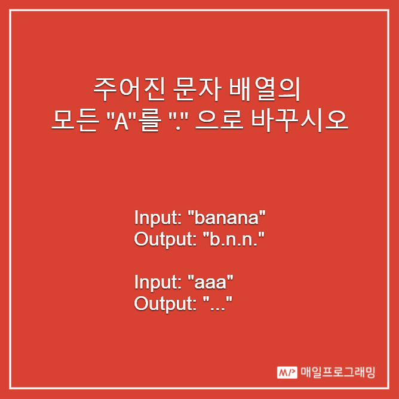

# 2019. 08. 01

## 오늘의 문제 : 

- [페이스북 매일프로그래밍 페이지](https://www.facebook.com/mailprogramming/)에 올라온 추가 문제
- 주어진 문자 배열의 모든 "A"를 "."으로 바꾸시오
- Input: "banana"
- Output: "b.n.n."
- Input: "aaa"
- Output: "aaa"

## 풀이 :

- 아스키테이블을 전부 매핑 char배열에 넣어놓고 a와 A만 . 값을 넣어둔다음 그냥 문자열을 매핑 배열의 값을 참조한다.
- 굳이 이렇게 푸는 이유는 매번 A인지 비교하는 로직을 빼서 성능을 최대한 끌어올리기 위해서다.
 
## 소스코드 : 

- [Java 풀이](../../src/main/java/dev/haenara/mailprogramming/solution/y2019/m08/d01/Solution190801.java)
- [테스트 코드](../../src/test/java/dev/haenara/mailprogramming/solution/y2019/m08/d01/Solution190801Test.kt)