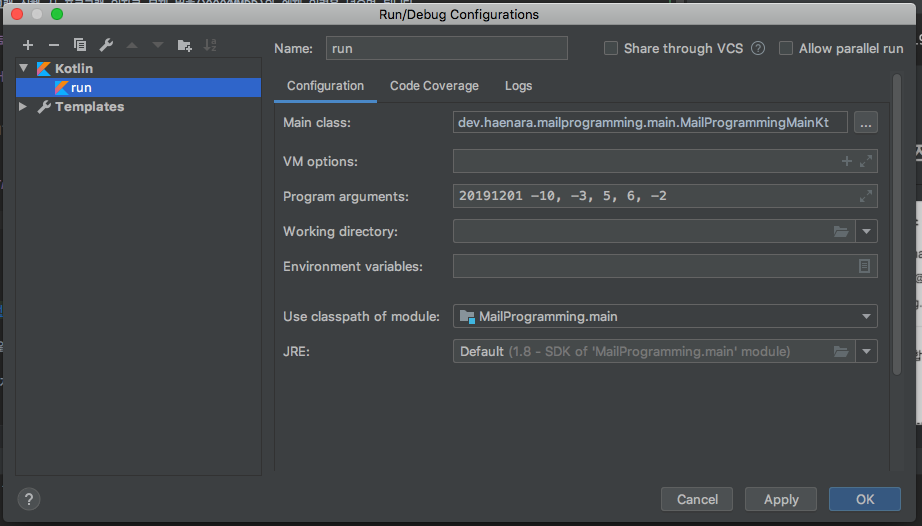
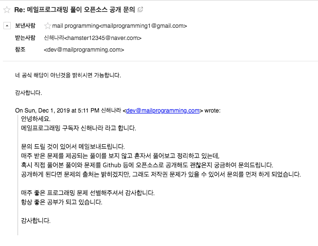

매일프로그래밍 문제 풀이
==================================

## ✉️ 매일프로그래밍?

- ✉️ [매일프로그래밍](https://mailprogramming.com)은 이메일로 코딩문제를 매주 이메일로 받아볼 수 있는 구독서비스 입니다.
- 💲무료로 구독하여 문제만 받아볼 수도 있고, 유료구독 시 문제풀이와 해설을 함께 받아 볼 수 있습니다. 
- 📭 매일프로그래밍 구독 : https://mailprogramming.com

## 📝 문제 풀이?

- **본 저장소에서 다루는 해답은 매일프로그래밍의 공식 해답이 아닙니다.**
- 본 저장소에서 다루는 해답은 개인적인 풀이이며 틀린 부분이 있을 수 있습니다. 

## 💡 풀이 목록

- [2019. 07. 21](2019/07/20190721.md)
- [2019. 08. 04](2019/08/20190804.md)
- [2019. 08. 11](2019/08/20190811.md)
- [2019. 12. 01](2019/12/20191201.md)
- [2019. 12. 08](2019/12/20191208.md)
- [2019. 12. 15](2019/12/20191215.md)
- [2019. 12. 22](2019/12/20191222.md)
- [2019. 12. 29](2019/12/20191229.md)

## ▶️ 예제 실행

- 코틀린 프로젝트로 구성되어 있어서, 실제로 gradle로 빌드하면 실행해 볼 수 있습니다.
- 프로그램 실행 시 프로그램 인자로 문제 번호(YYYYMMDD)와 예제 입력을 넣으면 됩니다.

### 프로젝트 실행 예제

#### 커맨드라인 실행 시
 
```
./gradlew run --args '20191201 -10, -3, 5, 6, -2'
```

#### IntelliJ 실행 시

- 

1. 실행 버튼 옆의 **Edit Configurations...** 선택
2. 좌측 **+버튼** 클릭 후 **Kotlin**선택
2. **Use classapth of module**는 MailProgramming.main 선택
3. **Main class**는 dev.haenara.mailprogramming.MainKt 선택
4. **Program arguments**는 문제 번호(YYYYMMDD)와 예제 입력

## ©️ 라이선스 및 저작권



- **매일 프로그래밍의 모든 문제와 해설 저작권은 매일프로그래밍에게 있습니다.**

- 해당 저장소에 올라온 해답의 저작권은 작성자에게 있으며 MIT 라이선스를 따릅니다.


```
MIT License

Copyright (c) 2019 Haenala Shin

Permission is hereby granted, free of charge, to any person obtaining a copy
of this software and associated documentation files (the "Software"), to deal
in the Software without restriction, including without limitation the rights
to use, copy, modify, merge, publish, distribute, sublicense, and/or sell
copies of the Software, and to permit persons to whom the Software is
furnished to do so, subject to the following conditions:

The above copyright notice and this permission notice shall be included in all
copies or substantial portions of the Software.

THE SOFTWARE IS PROVIDED "AS IS", WITHOUT WARRANTY OF ANY KIND, EXPRESS OR
IMPLIED, INCLUDING BUT NOT LIMITED TO THE WARRANTIES OF MERCHANTABILITY,
FITNESS FOR A PARTICULAR PURPOSE AND NONINFRINGEMENT. IN NO EVENT SHALL THE
AUTHORS OR COPYRIGHT HOLDERS BE LIABLE FOR ANY CLAIM, DAMAGES OR OTHER
LIABILITY, WHETHER IN AN ACTION OF CONTRACT, TORT OR OTHERWISE, ARISING FROM,
OUT OF OR IN CONNECTION WITH THE SOFTWARE OR THE USE OR OTHER DEALINGS IN THE
SOFTWARE.
```
